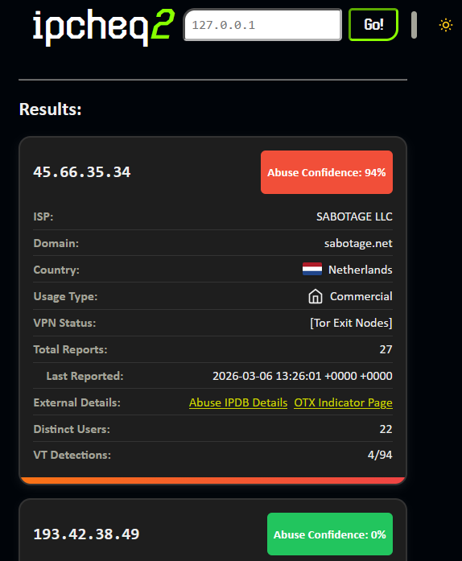

# ipcheq2

Aggregate data from AbuseIPDB and Spur to investigate IPs!



## Features
- Search results history!
- IPv4 and IPv6 support!
- Concise, distraction-free results without any marketing!
- Linux and Windows both supported!

## Quick Start with Docker

### Using Docker Run
```bash
# supply an abuseipdb api key
docker run -p 8080:8080 -e ABIPDBKEY=your_api_key_here ghcr.io/tlop503/ipcheq2:latest
```

Note: As of this release, `spur.us` queries require a valid session cookie. You must supply a `SPUR_SESSION_COOKIE` environment variable containing your session cookie (for example: `session=abcdef...`). The container will refuse to start without it.

### Using Docker Compose
1. Create a `docker-compose.yml` file:
```yaml
version: '3.8'
services:
  ipcheq2:
    image: ghcr.io/tlop503/ipcheq2:latest
    ports:
      - "8080:8080"
    environment:
  - ABIPDBKEY=your_api_key_here
  - SPUR_SESSION_COOKIE="__session=your_spur_session_cookie_here"
    restart: unless-stopped
```

2. Run the application:
```bash
docker-compose up -d
```

## Run locally
1. Download exe or elf from the latest [release](https://github.com/tlop503/ipcheq2/releases/latest). Download and extract the prefixes as well.
```
├── ipcheq2 or ipcheq2.exe
└── prefixes
        ├── ipv4.txt
        ├── ipv6.txt
        ├── update_prefixes.py
        └── upstream-list.hash
```
1. Create a .env file with an AbuseIPDB API Key (see `.env.example`) in the same directory, or set an enviornment variable.
1. Add your Spur session cookie to the `.env` file as `SPUR_SESSION_COOKIE` (mandatory). The value should match the Cookie header value your browser sends to spur.us for an authenticated session. Example:

```env
ABIPDBKEY=your_abuseipdb_key_here
SPUR_SESSION_COOKIE=session=abcdef0123456789
```
1. Update the icloud prefixes if desired with the bundled Python script.
1. Run the executable! ipcheq2 will serve on localhost:8080.

## Development Setup

### Prerequisites
- Go 1.23+
- AbuseIPDB API key

### Local Development
1. Clone the repository:
```bash
git clone https://github.com/tlop503/ipcheq2.git
cd ipcheq2
```

2. Create a `.env` file:
```bash
cp .env.example .env
# Edit .env and add your ABIPDBKEY
# Alternatively, enviornment variables can be used.
```

3. Run the application:
```bash
go run main.go
# or
go build . # inside project
./ipcheq2
```

4. Open your browser to `http://localhost:8080`

#### Updating iCloud Private Relay prefixes

[A script is provided](prefixes/update_prefixes.py) to update the iCloud Private Relay prefixes within the repo.
Before running it, make sure that you're inside the `prefixes/` directory.

## Deployment

### GitHub Container Registry
This project is automatically built and published to GitHub Container Registry via GitHub Actions.

### Manual Build
```bash
docker build -t ipcheq2 .
docker run -p 8080:8080 -e ABIPDBKEY=your_api_key_here ipcheq2
```
