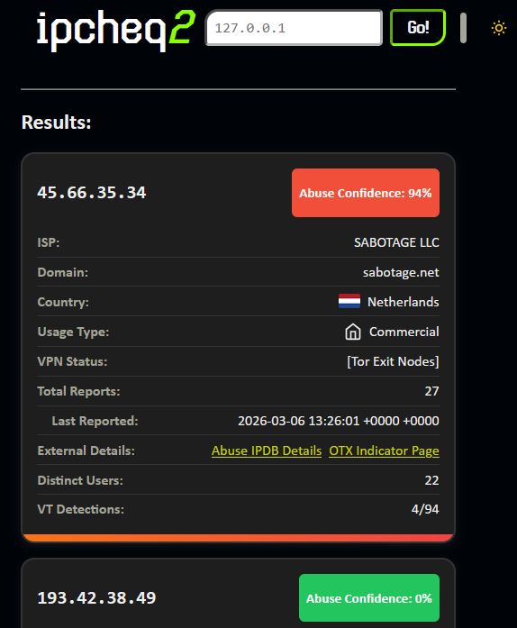

# ipcheq2

Aggregate data from AbuseIPDB, VPNID, and VirusTotal to investigate IPs!



## Features
- Multi-result dashboard for large investigations
- Extendable data-- bring your own sources to supplement ours
- Concise, distraction-free results without any marketing
- Linux and Windows both supported!
- Choose between serving a Web UI, Headless API, or both
  - Use `-h` for details on flags
- Fully portable binary w/ bundled data
- Update iCloud data from the cli w/o installing a new binary!

### IP Data Sources:
- AbuseIPDB
- VirusTotal (Optional)
- iCloud Private Relays (Supports updating!)
- Cyberghost
- Express VPN
- Mullvad VPN
- Nord VPN
- PIA
- Proton VPN
- Surfshark VPN
- Tor Exit Nodes
- Tunnelbear VPN

Want to see another source here? Open a PR with a file or an issue with a link!

## Quick Start with Docker

### Using Docker Run
```bash
# supply api keys
docker run -p 8080:8080 -e ABIPDBKEY=your_api_key_here -e VTKEY=your_api_key_here ghcr.io/tlop503/ipcheq2:latest <optional --mode webui|api|headless>
# optionally, use "--update" at the end to refresh iCloud data within the container
```

### Using Docker Compose
1. Create a `docker-compose.yml` file containing:
```yaml
version: '3.8'
services:
  ipcheq2:
    image: ghcr.io/tlop503/ipcheq2:latest
    command: ["--mode", "webui|api|headless"] # optional
    ports:
      - "8080:8080"
    environment:
      - ABIPDBKEY=your_api_key_here
      - VTKEY=your_api_key_here # Optional
    restart: unless-stopped
```

2. Run the application:
```bash
docker-compose up -d
```

## Run locally
1. Download exe or elf from the latest [release](https://github.com/tlop503/ipcheq2/releases/latest), or build from source (see "Local Development" below).
2. Run the executable once. On first startup, bundled provider data is hydrated to your user cache directory:
  - Linux: $XDG_CACHE_HOME/ipcheq2/data (or ~/.cache/ipcheq2/data)
  - Windows: %LocalAppData%/ipcheq2/data
3. Configure API keys using either:
  - User config keys file:
    - Linux: `$XDG_CONFIG_HOME/ipcheq2/keys.yaml` (or `~/.config/ipcheq2/keys.yaml`)
    - Windows: `%APPDATA%/ipcheq2/keys.yaml`
    - Run the executable once to create a blank keyfile, or download and fill out the [example](keys.example.yaml).
  - Environment variables: ABIPDBKEY and (optional) VTKEY
  - *Note: .env loading is deprecated and ignored at runtime.*
4. Optionally add your own source files and update the config:
  - Relative source paths in the config are resolved from the cache root (for example: data/my-source.txt)
  - Absolute source paths are used as-is
5. Run the executable. ipcheq2 serves on localhost:8080.

## Development Setup

### Prerequisites
- Go 1.23+
- AbuseIPDB API key
- VirusTotal API key (optional)

### Local Development
1. Clone the repository:
```bash
git clone https://github.com/tlop503/ipcheq2.git
cd ipcheq2
```

2. Create a keys file in your user config directory:
```bash
mkdir -p ~/.config/ipcheq2
cp keys.example.yaml ~/.config/ipcheq2/keys.yaml
# Edit keys.yaml and add your abipdbKey, vtKey
# Note, a blank keyfile is automatically generated on startup if needed
# Alternatively, environment variables can be used.
```

3. Run the application:
```bash
go run ./cmd/server
# or
go build -o ipcheq2 ./cmd/server
./ipcheq2
```

4. Open your browser to `http://localhost:8080`

## Deployment

### GitHub Container Registry
This project is automatically built and published to GitHub Container Registry via GitHub Actions.

### Manual Build
```bash
docker build -t ipcheq2 ./dockerfiles
docker run -p 8080:8080 -e ABIPDBKEY=your_api_key_here VTKEY=your_api_key_here ipcheq2
```

Data Sources:  
vpn_by_asn retrieved from https://github.com/X4BNet/lists_vpn. Copyright (c) 2024 X4B (Mathew Heard).
Supplemented with https://github.com/NazgulCoder/IPLists?tab=readme-ov-file. Copyright (c) 2025 Nazgul.
